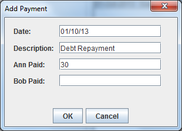

# What is IOU?
A desktop application that helps two people keep track of money owed by one to the other. It would typically be
useful to a couple, roommates, or any two people that incur shared expenses and/or often lend money to each other. IOU
keeps a record of all transactions and calculates the current balance.

# How does it work?
IOU supports two types of transactions, payments and expenses.

## Expenses
Shared expenses should be entered into the table on the right-hand side. It is assumed that all shared expenses should be
split 50/50. For example, if Ann and Bob have a current balance of $0 (neither owes the other anything), then they
receive a gas bill for $100, Ann pays $20 and Bob pays $80, the expense should be entered like so:

After this expense is saved, the current balance will indicate that Ann owes Bob $30.

## Payments

A payment occurs when one party gives money directly to the other. Typically, a payment will either be a loan or repayment
of an outstanding debt. For example, following the gas bill expense, Ann owes Bob $30. Ann repays this debt by transferring
$30 to his current account. This should be entered as a payment like so:

After this payment is saved, the current balance will indicate that neither Ann nor Bob owes the other anything.

## Archive

By default, all payments are
